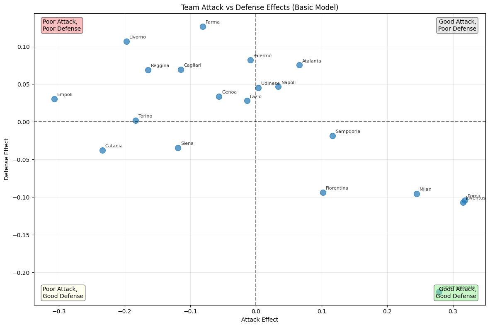
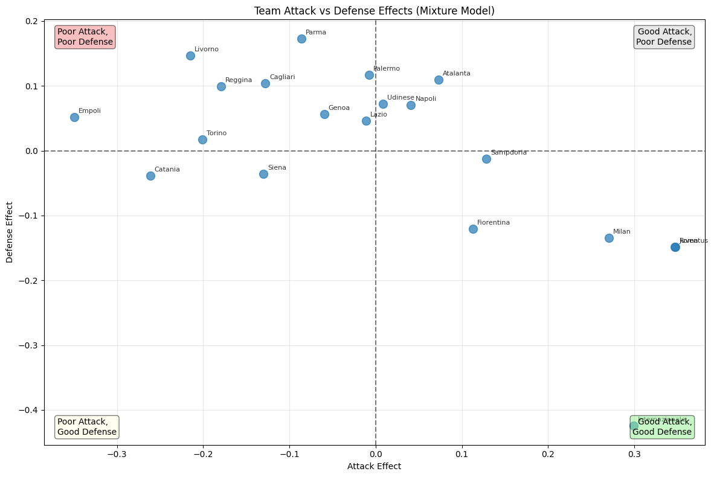
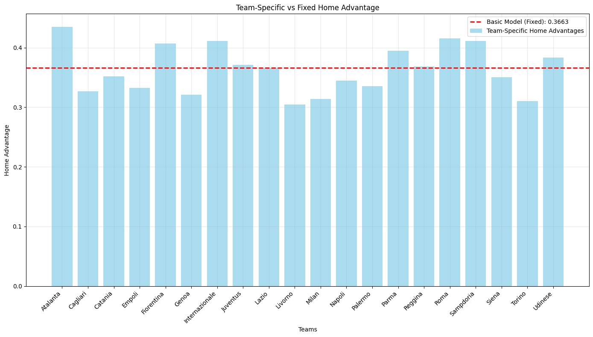
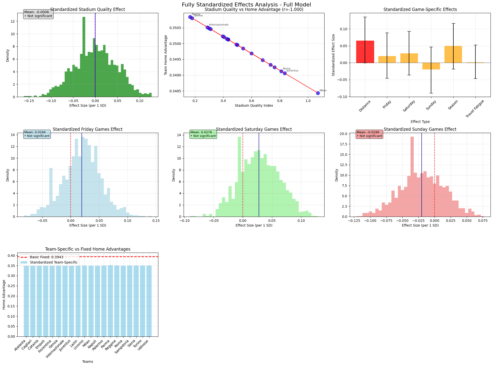

# Bayesian Hierarchical Model for Football Prediction

Replication and extension of **Baio & Blangiardo (2010)** using PyMC v5.  The project builds a family of four Bayesian hierarchical models for Italian Serie A match results, replicated from the original paper and then extended with two original contributions: team-specific home advantage and a composite covariate model for home-advantage drivers.  All inference is performed with MCMC (NUTS), diagnostics via ArviZ, and results validated against multiple seasons.

> **Academic context**: submitted as a course project for *Probabilistic Modelling* at **Leuphana University of Lüneburg**, Summer Semester 2025 (July 2025).

---

## Base paper

> Baio, G., & Blangiardo, M. (2010).  
> **[Bayesian hierarchical model for the prediction of football results.](references/baio_blangiardo_2010.pdf)**  
> *Journal of Applied Statistics*, 37(2), 253–264.  
> https://doi.org/10.1080/02664760802684177

---

## Models

### Replication (Baio & Blangiardo)

| Model | Description |
|-------|-------------|
| **Basic** | Poisson goals with hierarchical attack/defence effects and a single scalar home-advantage parameter. Verified against Table 2 of the paper on 1991/92 Serie A, then applied to 2007/08. |
| **Mixture** | Three-group Dirichlet/Categorical mixture prior on team strength (bottom / mid / top tier). Student-*t* (ν = 4) within-group distributions capture heavier tails. Reduces total MAE by **20.9 %** vs Basic on the 2007/08 season. |

### Original Contributions

| Contribution | Description |
|---|---|
| **Team-Specific Home Advantage** | Replaces the scalar home-advantage parameter with a team-length vector drawn from a shared Normal hyperprior. Reveals that home-advantage varies substantially across clubs — Torino and Siena consistently show the lowest effect, while clubs with larger, more-utilised stadiums sit at the top. |
| **Covariate Home-Advantage Model** | Decomposes home advantage into measurable drivers: stadium quality (composite index collapsing capacity, attendance, and utilisation to avoid multicollinearity), road distance between cities, day-of-week effects (Friday / Saturday / Sunday dummies), season phase, and away-team travel fatigue.  All predictors are z-score standardised so posterior coefficients are directly comparable. |

---

## Key results

- **Home advantage**: posterior mean ≈ 0.37 on the log scale → home teams score **≈ 1.44 ×** more goals on average (Basic model, 2007/08).
- **Mixture model**: 20.9 % lower total MAE than Basic on the 2007/08 season across points, goals scored/conceded, and W/D/L.
- **Team-specific home advantage**: significant cross-club variation; large, high-utilisation stadiums correlate with stronger home effects.
- **Covariate model**: stadium quality and travel fatigue are the dominant drivers; day-of-week effects are small and largely non-significant.
- **Generalisation** (2022/23 season): home-advantage magnitude and team-ranking patterns replicate well, with minor shifts reflecting squad changes over 15 years.

### Season simulation — 2007/08 (Basic vs Mixture)

Predicted final-season points for a representative subset of clubs (top 6 + bottom 3).  The Mixture model consistently tracks observed points more closely.

| Club | Observed | Basic | Mixture |
|------|:---:|:---:|:---:|
| Internazionale | 85 | 76 | 81 |
| Roma | 82 | 72 | 76 |
| Juventus | 72 | 66 | 69 |
| Fiorentina | 66 | 60 | 62 |
| AC Milan | 64 | 59 | 61 |
| Udinese | 57 | 52 | 54 |
| … | … | … | … |
| Livorno | 30 | 39 | 36 |
| Empoli | 27 | 38 | 34 |
| Reggina | 25 | 36 | 33 |
| **Total MAE** | — | **24.20** | **19.14** |

> **Note**: per-model comparisons for the Contribution models (Team Home and Covariate) are in `notebooks/03_contributions_2007-08.ipynb`, where the full CovariateModel results are shown alongside cross-validation (WAIC / LOO).

### Season simulation — 2022/23 (Basic vs Mixture)

The Mixture model generalises well: 15.9 % lower total MAE than Basic on the held-out 2022/23 season (vs 20.9 % on 2007/08).

| Club | Observed | Basic | Mixture |
|------|:---:|:---:|:---:|
| Napoli | 90 | 75 | 78 |
| Lazio | 74 | 66 | 68 |
| Juventus | 72 | 63 | 65 |
| Internazionale | 72 | 67 | 67 |
| AC Milan | 70 | 62 | 63 |
| Atalanta | 64 | 61 | 61 |
| Roma | 63 | 57 | 59 |
| … | … | … | … |
| Sampdoria | 19 | 30 | 28 |
| **Total MAE** | — | **18.25** | **15.35** |

### Team attack vs defence — Basic model (2007/08)

Roma and Juventus sit firmly in the *Good Attack / Good Defence* quadrant; Empoli, Livorno, and Reggina occupy the opposite corner.  The scatter reflects the actual 2007/08 Serie A standings closely.



### Team attack vs defence — Mixture model (2007/08)

The three-group mixture prior sharpens team separation: the defence axis range roughly doubles compared to the Basic model, and Internazionale's defensive superiority becomes more pronounced.  This tighter clustering underlies the 20.9 % MAE improvement.



### Contribution 1 — Team-specific home advantage (2007/08)

Posterior mean home advantages per club, compared to the Basic model's single scalar estimate (red dashed line).  Clubs with the weakest home effects (Livorno, Torino, Siena) fall well below the population mean; those with the strongest (Atalanta, Parma, Roma) gain substantially more from playing at home.



### Contribution 2 — Fully standardised covariate model (2007/08)

All predictors are z-score standardised, so the posterior distributions are directly comparable.  The top-left panel shows the posterior for the stadium quality coefficient; the top-centre scatter confirms the positive relationship between stadium quality and team-level home advantage.  Day-of-week effects (Fri/Sat/Sun panels) are small and centred on zero, consistent with weak evidence of scheduling effects in this era of Serie A.



---

## Repository structure

```
bayesian-football-prediction/
│
├── data/
│   ├── README.md                                      # Column reference and known quirks
│   ├── italy_serie-a_1991-1992.xlsx                   # 306 matches — paper verification
│   ├── final dataset 2007-08.xlsx                     # 380 matches — main replication
│   ├── final_dataset_2007-08_stadium&distance&date.xlsx  # Enhanced (+ stadium, distance, date)
│   └── final_dataset_2022-23_stadium&distance&date.xlsx  # Generalisation test season
│
├── src/
│   ├── data_loader.py          # FootballDataLoader — normalises all column-name variants
│   ├── models/
│   │   ├── basic_model.py      # BasicModel (Poisson + hierarchical att/def)
│   │   ├── mixture_model.py    # MixtureModel (3-group Dirichlet/Categorical/Student-t)
│   │   ├── team_home_model.py  # TeamHomeModel (team-vector home advantage)
│   │   └── covariate_model.py  # CovariateModel (stadium, distance, weekday, fatigue)
│   ├── evaluation/
│   │   └── comparison.py       # MAE tables, WAIC/LOO, season simulation
│   └── visualization/
│       └── plots.py            # Team-effect scatter, traceplots, beta histograms
│
├── notebooks/
│   ├── 01_paper_verification_1991-92.ipynb   # Verify against Table 2 of Baio & Blangiardo
│   ├── 02_replication_2007-08.ipynb          # Basic vs Mixture, 2007/08
│   ├── 03_contributions_2007-08.ipynb        # Contributions 1 & 2, enhanced 2007/08 data
│   └── 04_generalisation_2022-23.ipynb       # Generalisation to 2022/23 season
│
├── assets/                     # Figures embedded in this README
│   ├── team_effects_basic_2007-08.png
│   ├── team_effects_mixture_2007-08.png
│   ├── team_home_advantage_comparison.png
│   └── covariate_effects_standardised.png
│
├── references/
│   └── baio_blangiardo_2010.pdf   # Base paper (Baio & Blangiardo 2010)
│
├── pre-restructured/           # Original Colab submission files (legacy reference)
├── requirements.txt
├── .gitignore
└── README.md
```

---

## Setup

```bash
# 1. Clone the repository
git clone https://github.com/farmand-bt/bayesian-football-prediction.git
cd bayesian-football-prediction

# 2. Create and activate a virtual environment (recommended)
python -m venv .venv
# Windows:
.venv\Scripts\activate
# macOS/Linux:
source .venv/bin/activate

# 3. Install dependencies
pip install -r requirements.txt

# 4. Launch Jupyter and open any notebook
jupyter notebook notebooks/
```

> **Note**: PyMC uses multiprocessing for parallel chains.  On Windows, calls to `fit_*()` methods default to `cores=1` to avoid spawn-related issues.  Set `cores=4` on Linux/macOS for faster sampling.

---

## Running the models

Each notebook is self-contained and runs top-to-bottom.  The recommended order is 01 → 02 → 03 → 04, but any notebook can be run in isolation.

Sampling times on a modern laptop (CPU only, `cores=1`, `draws=2000`, `tune=2000`):

| Model | Approximate time |
|-------|-----------------|
| Basic | 5 – 10 min |
| Mixture | 20 – 40 min |
| Team Home | 8 – 15 min |
| Covariate | 10 – 20 min |

---

## License

This project is released under the MIT License.  The football data files are open-source public statistics and are committed directly to the repository for reproducibility.
